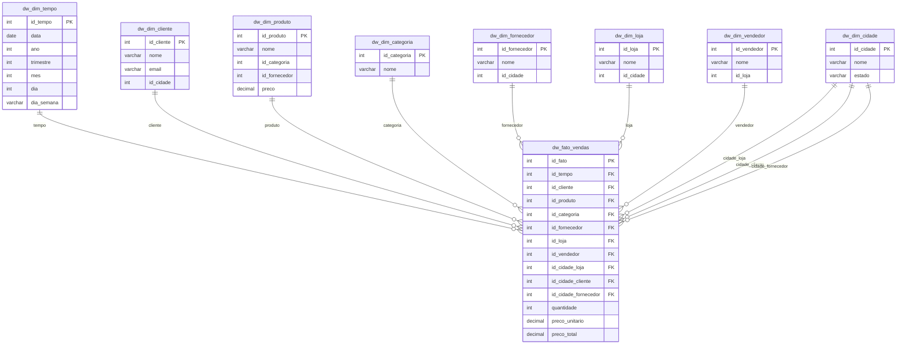

Plano de ensino - Modelagem e projeto de banco de dados

**Planos de aula Modelagem e Projeto de Banco de Dados**


- [:floppy\_disk: 1. Turma: Modelagem e Projeto de Banco de Dados](#floppy_disk-1-turma-modelagem-e-projeto-de-banco-de-dados)
  - [:watch: 1.1. Carga Horária Total: 60](#watch-11-carga-horária-total-60)
  - [:hourglass\_flowing\_sand: 1.2. Horário: 19hs - 22hs](#hourglass_flowing_sand-12-horário-19hs---22hs)
  - [:page\_with\_curl: 1.3. Ementa](#page_with_curl-13-ementa)
  - [:page\_with\_curl: 1.4. Metodologia](#page_with_curl-14-metodologia)
  - [:page\_with\_curl: 1.5. Procedimentos de avaliação de aprendizagem](#page_with_curl-15-procedimentos-de-avaliação-de-aprendizagem)
  - [:hourglass\_flowing\_sand: 1.6. Horário de atendimento](#hourglass_flowing_sand-16-horário-de-atendimento)
- [:globe\_with\_meridians: 2. Sites utilizados](#globe_with_meridians-2-sites-utilizados)
- [:abacus: 3. Repositórios de apoio](#abacus-3-repositórios-de-apoio)
- [:date: 4. Datas de aulas e conteúdo](#date-4-datas-de-aulas-e-conteúdo)
- [:date: 5. Unidades de avaliações](#date-5-unidades-de-avaliações)
- [:hammer\_and\_wrench: 6. Links para download de ferramentas](#hammer_and_wrench-6-links-para-download-de-ferramentas)
- [:books: 7. Livros](#books-7-livros)
  - [:newspaper: 8. Artigos (referências bibliográficas complementares)](#newspaper-8-artigos-referências-bibliográficas-complementares)
- [:notebook: 9. Cursos gratuítos (opcionais)](#notebook-9-cursos-gratuítos-opcionais)
- [:green\_book: 10. Como estudar (dicas)](#green_book-10-como-estudar-dicas)
- [:family\_man\_woman\_girl\_boy: 11. Grupos no telegram](#family_man_woman_girl_boy-11-grupos-no-telegram)
- [:tv: 12. Videos recomendados (material opcional)](#tv-12-videos-recomendados-material-opcional)
- [:green\_book: 13. Exemplos de modelos](#green_book-13-exemplos-de-modelos)
  - [:green\_book: 13.1. Exemplo de gráfo](#green_book-131-exemplo-de-gráfo)
  - [:green\_book: 13.2. Exemplo de modelo estrela](#green_book-132-exemplo-de-modelo-estrela)
- [:alarm\_clock: 14. Carga horária de 15hs adicionais (remota/online)](#alarm_clock-14-carga-horária-de-15hs-adicionais-remotaonline)
  - [🎓 14.1. Playlist de Banco de Dados (15h)](#-141-playlist-de-banco-de-dados-15h)
  - [📄 14.2. Artigos Científicos Open Access sobre Banco de Dados](#-142-artigos-científicos-open-access-sobre-banco-de-dados)
- [15. Bancos de dados da fundação Apache](#15-bancos-de-dados-da-fundação-apache)
- [16. OLTP --\> OLAP](#16-oltp----olap)
  - [16.1. Banco OLTP](#161-banco-oltp)
    - [16.1.1. Comandos SQL p/ OLTP](#1611-comandos-sql-p-oltp)
    - [16.1.2. Diagrama ER OLTP](#1612-diagrama-er-oltp)
  - [16.2. Banco OLAP --\> DW](#162-banco-olap----dw)
  - [16.2.1. Diagram ER OLAP DW](#1621-diagram-er-olap-dw)
  - [16.2.2. Fatos resumidas](#1622-fatos-resumidas)


---
## :floppy_disk: 1. Turma: Modelagem e Projeto de Banco de Dados

### :watch: 1.1. Carga Horária Total: 60

### :hourglass_flowing_sand: 1.2. Horário: 19hs - 22hs

### :page_with_curl: 1.3. Ementa

* Conceitos sistemas de gerenciamento de banco de dados;
* Níveis de arquiteturas de banco de dados; 
* Modelo Relacional: Conceitos;
* Restrições e Normalização; 
* Modelos de banco de dados não-relacional.

### :page_with_curl: 1.4. Metodologia

* Aulas expositivas, dialogadas, com apresentação de conceitos teóricos/práticos.
* Aulas com comentários de casos de interesse correlatos e comentários sobre eventuais produtos e tecnologias relacionadas ao tema da disciplina. 
* Aulas complementares, faltantes ou remotas(EaD), serão atribuidas com conteúdos disponíveis na plataforma SIGAA.

###  :page_with_curl: 1.5. Procedimentos de avaliação de aprendizagem

**Prova presencial** escrita objetiva de múltipla escolha. Cálculo de notas por soma de pontos simples. Cada avaliação vale 10 pontos. São 3 avaliações. Resultado final via média simples entre avaliações. Excepcionalmente poderão ocorrer avaliações online. Poderão ocorrer atividades online objetivando fixação de conceitos (valendo pontos ou não).

**Provas de 2ª chamada** devem ser requisitas dentro do prazo e formalmente conforme regras da faculdade. A prova de 2ª chamada é discursiva, escrita (tipo canetão).

A **carga horária remota/EAD** será realizada via: a) leitura de artigos postados pelo professor (ou videos correlatos aos assuntos abordados em sala); b) exercícios disponíveis na plataforma EaD da instituição ou c) envio de trabalho, conforme o caso. Este material também poderá estar na sua avaliação presencial escrita. O material usado nas atividades EAD será disponibilizado no site do professor e na página da disciplina no SIGAA e no github.

A **1ª avaliação** terá o conteúdo das aulas de 1 a 5.

A **2ª avaliação** terá o conteúdo das aulas 6 a 9.

A **3ª avaliação** terá o conteúdo das aulas 11 a 14 e os artigos selecionados.

Temos 15 encontros presenciais, sequênciais, 1 ves por semana; nos encontros 5, 10 e 15, teremos as avaliações.

**Notas:** Cada uma das três avaliações vale 0 à 10,0. A média final da disciplina é feita fazendo média aritmética simples entre as notas obtidas. O aluno será considerado aprovado se atingir média igual ou superior a 6,0. Alunos com nota >= 4,0 e < 6,0 têm direito à nota de exame final. 

**Prova final:** (PF) ou exame final será aplicado após a avaliação 3. A avaliação poderá **escrita** objetiva (tipo canetão). O conteúdo será... **TODO** o conteúdo ministrado ao longo do semestre. A prova final deve ser requisitada na Secretaria Acadêmica.

### :hourglass_flowing_sand: 1.6. Horário de atendimento

No dias de aula da disciplina. 30 minutos antes da aula (via agendamento prévio pelo sistema SIGAA).

---
## :globe_with_meridians: 2. Sites utilizados


|Sites utilizados|Url|
|-----|-----|
|Site do professor	| https://www.pontodeensino.com |
|Site das disciplinas | https://sites.google.com/unemat.br/professoremiliano |
|Sites das disciplinas no github | https://github.com/monteiro74/aulas_2025_1 |
|Sistema Acadêmico | https://sigaa.unemat.br/sigaa/verTelaLogin.do|
| Link Tree do curso | https://linktr.ee/si.unemat |
| Página do curso | https://sinop.unemat.br/faculdades/facet/graduacao/sistemas-de-informacao-bacharelado-graduacao-presencial-noturno-sinop |

---
## :abacus: 3. Repositórios de apoio

|Sites utilizados|Url|
|-----|-----|
| Resumo de diagramas para Engenharia de Software | https://github.com/monteiro74/diagramas_resumo  |
| Lista de ferramentas | https://github.com/monteiro74/lista_de_ferramentas |

---
## :date: 4. Datas de aulas e conteúdo


|Aula | Data   | Carga horária| Conteúdo |
|-----|--------|--------------|----------|
| 1   | 14/08 | 3hs |  |
| 2   | 21/08 | 3hs |  |
| 3   | 28/08 | 3hs |  |
| 4   | 04/09 | 3hs |**Avaliação 1**. |
| 5   | 11/09 | 3hs |  |
| 6   | 18/09 | 3hs |  |
| 7   | 25/09 | 3hs |  |
| 8   | 02/10 | 3hs |  |
| 9   | 09/10 | 3hs |  |
| 10  | 16/10 | 3hs |  |
| 11  | 23/10 | 3hs |  |
| 12  | 30/10 | 3hs | **Avaliação 2**. |
| 13  | 06/11 | 3hs |  |
| 14  | 13/11 | 3hs |  |
| 15  | 20/11 | 3hs | **Avaliação 3** |


## :date: 5. Unidades de avaliações

* Avaliação 1: 04/09/2025.
* Avaliação 2: 30/10/2025.
* Avaliação 3: 20/11/2025.

---
## :hammer_and_wrench: 6. Links para download de ferramentas

1. [Laragon](https://laragon.org/download/)
2. [Heidi SQL](https://www.heidisql.com/download.php)
3. [MS Sql Server Express 2022](https://go.microsoft.com/fwlink/p/?linkid=2216019&clcid=0x416&culture=pt-br&country=br)
4. [MS Sql Server Management Studio](https://learn.microsoft.com/pt-br/sql/ssms/download-sql-server-management-studio-ssms?view=sql-server-ver16)
5. [Visual Studio Code](https://code.visualstudio.com/download)
6. [Github Desktop](https://desktop.github.com/download/)
7. [DBeaver Community](https://dbeaver.io/download/)
8. [CouchDB](https://couchdb.apache.org/)
9.  [MySQL Workbench](https://dev.mysql.com/downloads/workbench/)
10. [Postgresql](https://www.postgresql.org/download/windows/)
11. [SQL Server Migration Assistant (SSMA) for MySQL](https://www.microsoft.com/en-us/download/details.aspx?id=54257)
12. [PowerBI](https://www.microsoft.com/pt-br/download/details.aspx?id=58494)

MongoDB:

* [MongoDB Community Server](https://www.mongodb.com/try/download/community)<br>
* [MongoDB Compass](https://www.mongodb.com/try/download/compass)<br>
* [MongoDB Relational Migrator Download](https://www.mongodb.com/try/download/relational-migrator)<br>
* [Studio 3T Free for MongoDB](https://studio3t.com/free/)<br>


Ferramenta para pesquisa:  https://github.com/langchain-ai/local-deep-researcher


## :books: 7. Livros

* ELMASRI, Ramez; NAVATHE, Shamkant B. Sistemas de Banco de Dados. 6 a edição. Editora Addison, 2005.

* SILBERSCHATZ, Abraham; KORTH, Henry F.; SUDARSHAN, S. Sistema de banco de dados. Trad. Daniel Vieira. 6ed. Rio de Janeiro: Elsevier, 2012.
Este livro esta disponível na biblioteca online da Unemat em: https://integrada.minhabiblioteca.com.br/reader/books/9788595157552/epubcfi/6/2[%3Bvnd.vst.idref%3Dcover]!/4/2/2%4074:39

* DATE, Christopher J. Introdução a sistemas de bancos de dados. Elsevier Brasil, 2004.
Este livro esta disponível na biblioteca online da Unemat em: https://integrada.minhabiblioteca.com.br/reader/books/9788595154322/epubcfi/6/2[%3Bvnd.vst.idref%3Dcapa.xhtml]!/4/2/2/4%4074:84

* MEDEIROS, Marcelo. Banco de dados para sistemas de informação. Visual Books. 2006.

* SETZER, V. W., SILVA, F. S. C. Banco de dados: aprenda o que são, melhore seu conhecimento, construa os seus. São Paulo: Edgard Blücher, 2005.
Este livro esta disponível na biblioteca online da Unemat em: https://integrada.minhabiblioteca.com.br/#/books/9788521216520/recent

* MONTEIRO, Emiliano Soares. Projeto de sistemas e bancos de dados. Rio de Janeiro: Brasport, 2004. 321. ISBN: 8574521760.

Referências na biblioteca virtual:
[referências bibliográficas](https://docs.google.com/presentation/d/1StFHjTjcc9mpTTDoWmMHJibmx2n17o8FLwxMhHskXZo/view).


---
### :newspaper: 8. Artigos (referências bibliográficas complementares)

Diagrama Entidade-Relacionamento: uma ferramenta para modelagem de dados conceituais em Engenharia de Software
https://rsdjournal.org/index.php/rsd/article/download/17776/15626/221575

O uso da abordagem sistêmica na modelagem de banco de dados
https://www.aedb.br/seget/arquivos/artigos12/65416864.pdf

Uma proposta de aplicação de business intelligence no chão-de-fábrica
https://www.scielo.br/j/gp/a/ydtVGxxBtD65zcx4VmJDJGw/?format=pdf

Os desafios da administração pública na disponibilização de dados sensíveis
https://www.scielo.br/j/rdgv/a/GCMwrvnHzP4mJD3xZKNsnTq/?format=pdf

 


---


---
## :notebook: 9. Cursos gratuítos (opcionais)

* [Projeto Real DER (conceitual) com Banco de dados SQL SERVER](https://www.udemy.com/course/projeto-real-derconceitual-com-banco-de-dados-sql-server/)

* [Série DBA SQL Server - Preparação, instalação e configuração](https://www.udemy.com/course/sqlserver-instalacao-e-configuracao/)

* [Microsoft SQL for Beginners (SQL Server and T-SQL)](https://www.udemy.com/course/microsoft-sql-for-beginners-sql-server-and-t-sql/)

* [Introdução a banco de dados com MySQL & PHPMyAdmin](https://www.udemy.com/course/mysql_phpmyadmin/)

* [Introdução a Bancos de Dados e Linguagem SQL](https://www.udemy.com/course/introducao-a-bancos-de-dados-e-linguagem-sql/)

* [Como conectar com o SQL Server (Lesson 1: Connecting to the Database Engine)](https://learn.microsoft.com/en-us/sql/relational-databases/lesson-1-connecting-to-the-database-engine?view=sql-server-ver16)

* [Conectando e realizando consultas no SQL Server(Quickstart: Connect and query a SQL Server instance using SQL Server Management Studio (SSMS))](https://learn.microsoft.com/en-us/sql/ssms/quickstarts/ssms-connect-query-sql-server?view=sql-server-ver16)

* [Introdução à análise de dados da Microsoft](https://learn.microsoft.com/pt-br/training/powerplatform/power-bi).


---
## :green_book: 10. Como estudar (dicas)

3 técnicas indicadas por cientistas para qualquer pessoa melhorar nos estudos
https://www.youtube.com/watch?v=posTc56basM

As formas mais eficientes de estudar para prova
https://www.youtube.com/watch?v=1y0xBcGZJmk


---
## :family_man_woman_girl_boy: 11. Grupos no telegram


|Grupo | Link no Telegram |
| --- | --- |
| Vagas de TI para todos | https://t.me/vagastibr |
| Flutterflow Brasil | https://t.me/flutterflowbrazil |
| Bubble.ioBR | https://t.me/bubbleBR |
| Grupo de usuários Oracle Cloud Brasil | https://t.me/GUOCB |
| PHP Brasil | https://t.me/phpbrasil |
| Lazarus & Delphi Brasil | https://t.me/LazBrasil |
| Lazarus BR | https://t.me/LazarusBR | 
| MySQL BR | https://t.me/mysqlbr | 
| Python Brasil | https://linktr.ee/python.brasil | 
| C# Brasil | https://t.me/csharpbrasiloficial |
| Microsoft C#.Net | https://t.me/CSharpDevelopersBrasil |
| SQL Server GO | https://t.me/SQLServerGO |


---
## :tv: 12. Videos recomendados (material opcional)

1. ["NÃO PRECISAMOS MAIS DA TI" | FEBRABAN TECH 2024](https://www.youtube.com/watch?v=M-rlucvPG94)

2. [Scrum Master é um Inútil (não é só sobre isso)](https://www.youtube.com/watch?v=1eGSPUN0sj4)

3. [TIOZÃO DA FEBRABAN TEM RAZÃO](https://www.youtube.com/watch?v=Qjmmug9S3rI)

4. [De onde vem as boas ideias](https://www.youtube.com/watch?v=BtgnozUgc58)

5. [IA na Programação é um Caminho SEM VOLTA!](https://www.youtube.com/watch?v=d8cQn15P5TY)


---
## :green_book: 13. Exemplos de modelos

### :green_book: 13.1. Exemplo de gráfo

```mermaid

graph TD
    %% Nós (entidades principais)
    Alice["👩 Alice"]
    Bob["🧑 Bob"]
    Carol["👩‍🦰 Carol"]
    Post1["📝 Postagem 1"]
    Post2["📝 Postagem 2"]

    %% Relacionamentos (arestas)
    Alice -->|amigo de| Bob
    Bob -->|amigo de| Carol
    Alice -->|segue| Carol
    Carol -->|curtiu| Post1
    Bob -->|curtiu| Post2
    Alice -->|curtiu| Post1


```



### :green_book: 13.2. Exemplo de modelo estrela


---
## :alarm_clock: 14. Carga horária de 15hs adicionais (remota/online)

Este curso tem 45 horas presenciais + 15 horas remotas, totalizando **60hs**.

### 🎓 14.1. Playlist de Banco de Dados (15h)


| Título                                                      | Tópico Principal            | Duração Estimada | URL   |
|-------------------------------------------------------------|--------------------|------------------|-------|
| Curso de Modelagem de Dados (Playlist)                      | Modelagem de dados | 3h 00min         | [Link](https://www.youtube.com/playlist?list=PLucm8g_ezqNoNHU8tjVeHmRGBFnjDIlxD) |
| Introdução à Modelagem de Dados                             | Modelagem de dados | 0h 20min         | [Link](https://www.youtube.com/watch?v=W49AO7f93Jk) |
| 8 Etapas para Modelagem de Dados                            | Modelagem de dados | 0h 30min         | [Link](https://www.youtube.com/watch?v=UZcaZD5VG0g) |
| Normalização de Dados em Bancos de Dados (1FN, 2FN, 3FN)    | Normalização       | 0h 15min         | [Link](https://www.youtube.com/watch?v=TOFZQ5wm1UI) |
| Banco de Dados - Normalização - Parte 1                     | Normalização       | 0h 20min         | [Link](https://www.youtube.com/watch?v=Mhd2bI5pJuo) |
| O que são as Formas Normais em Bancos de Dados?             |Normalização        | 0h 15min         | [Link](https://www.youtube.com/watch?v=Cj84bb04tio) |
| Como usar índices no Banco de Dados (SQL Server)            | Índices            | 0h 20min         | [Link](https://www.youtube.com/watch?v=j1n6NX11-G4) |
| A melhor explicação sobre índices que você já viu           | Índices            | 0h 25min         | [Link](https://www.youtube.com/watch?v=F5Ak31ToOjo) |
| Indexação em Banco de Dados                                 | Índices            | 0h 15min         | [Link](https://www.youtube.com/watch?v=Ujl67TEXRKs) |
| OLAP vs OLTP                                                | DW, OLTP, OLAP     | 0h 10min         | [Link](https://www.youtube.com/watch?v=iw-5kFzIdgY) |
| Data Warehouse Tutorial For Beginners                       | DW, OLTP, OLAP     | 1h 00min         | [Link](https://www.youtube.com/watch?v=J326LIUrZM8) |
| What is ETL  What is Data Warehouse  OLTP vs OLAP           | DW, OLTP, OLAP     | 0h 10min         | [Link](https://www.youtube.com/watch?v=oF_2uDb7DvQ) |
| Processamento de Transações / ACID - Bancos de Dados 2020.2 | Processamento, ACID, Concorrência  | 0h 40min | [Link](https://www.youtube.com/watch?v=EF4JoNoDnJw) |
| Entenda ACID, Concorrência e Como Garantir Consistência!    | Processamento, ACID, Concorrência  | 0h 20min | [Link](https://www.youtube.com/watch?v=txw4WrO7Azo) |
| Introdução ao Controle de Concorrência de Transações        | Processamento, ACID, Concorrência  | 0h 30min | [Link](https://www.youtube.com/watch?v=kycoQMqc0mc) |

**⏱️ Duração Total Estimada:** 14h 20min


### 📄 14.2. Artigos Científicos Open Access sobre Banco de Dados


| Título                | Tópico Principal | Estimativa de Leitura | URL               |
|-----------------------|---------|-----------------------|-------------------|
| Critical data modeling and the basic representation model | Modelagem de dados | 1h 30min | [Link](https://asistdl.onlinelibrary.wiley.com/doi/10.1002/asi.24745) |
| Data Modeling and Data Analytics: A Survey from a Big Data Perspective   | Modelagem de dados | 1h 30min | [Link](https://www.researchgate.net/publication/288872507_Data_Modeling_and_Data_Analytics_A_Survey_from_a_Big_Data_Perspective) |
| The Database Normalization Theory and the Theory of Normalized Systems: Finding a Common Ground  | Normalização | 1h 30min  | [Link](https://www.researchgate.net/publication/297731569_The_Database_Normalization_Theory_and_the_Theory_of_Normalized_Systems_Finding_a_Common_Ground) |
| Mastering database normalization: A comprehensive exploration of normal forms  | Normalização  | 1h 00min  | [Link](https://www.researchgate.net/publication/374509386_Mastering_database_normalization_A_comprehensive_exploration_of_normal_forms) |
| Guide to academic journal indexing: Where, when, and how to get indexed  | Índices | 1h 00min  | [Link](https://blog.scholasticahq.com/post/index-types-for-academic-journal/)  |
| Data warehousing, data mining, OLAP and OLTP technologies are essential elements to support decision-making process in industries | DW, OLTP e OLAP | 1h 30min  | [Link](https://www.researchgate.net/publication/50235148_DATA_WAREHOUSING_DATA_MINING_OLAP_AND_OLTP_TECHNOLOGIES_ARE_ESSENTIAL_ELEMENTS_TO_SUPPORT_DECISION-MAKING_PROCESS_IN_INDUSTRIES) |
| An Overview of Data Warehousing and OLAP Technology | DW, OLTP e OLAP | 1h 00min  | [Link](https://www.microsoft.com/en-us/research/wp-content/uploads/2016/02/sigrecord.pdf) |
| High-Performance ACID via Modular Concurrency Control  | Processamento de Transações, ACID e Concorrência  | 1h 30min   | [Link](https://www.cs.cornell.edu/lorenzo/papers/Chao15Callas.pdf) |
| Concurrency control methods in distributed database: A review and comparison | Processamento de Transações, ACID e Concorrência | 1h 30min  | [Link](https://www.researchgate.net/publication/319367720_Concurrency_control_methods_in_distributed_database_A_review_and_comparison) |
| A Survey on Transactional Stream Processing | Processamento de Transações, ACID e Concorrência  | 1h 30min  | [Link](https://arxiv.org/pdf/2208.09827) |

**⏱️ Duração Total Estimada de Leitura:** 15h 00min


## 15. Bancos de dados da fundação Apache


| Banco de Dados | Descrição                                                                                                             |
| -------------- | --------------------------------------------------------------------------------------------------------------------- |
| **Cassandra**  | Banco NoSQL distribuído, orientado a colunas, altamente escalável, ideal para grandes volumes e alta disponibilidade. |
| **HBase**      | Banco NoSQL distribuído baseado no Bigtable, roda sobre Hadoop/HDFS, focado em armazenamento de dados massivos.       |
| **Derby**      | Banco de dados relacional leve e embutido, 100% Java, ótimo para aplicações embarcadas.                               |
| **Hive**       | Data warehouse sobre Hadoop, permite consultas SQL-like em grandes conjuntos de dados distribuídos.                   |
| **CouchDB**    | Banco NoSQL orientado a documentos, com interface REST, replicação fácil e arquitetura tolerante a falhas.            |
| **Ignite**     | Banco de dados em memória (IMDG) distribuído, suporta SQL, alta performance e transações ACID.                        |
| **Accumulo**   | Banco NoSQL distribuído, baseado em Bigtable, com segurança em nível de célula e alta escalabilidade.                 |
| **Druid**      | Banco analítico distribuído, otimizado para OLAP e consultas rápidas em grandes volumes de dados.                     |
| **Solr**       | Motor de busca baseado no Lucene, pode ser usado como banco para consultas textuais complexas.                        |
| **Kudu**       | Banco colunar distribuído para análises em tempo real, integrado ao ecossistema Hadoop.                               |
| **Geode**      | Banco de dados em memória distribuído, baixa latência e processamento de dados em tempo real.                         |
| **Jackrabbit** | Repositório de conteúdo (JCR), utilizado para armazenamento estruturado e hierárquico de documentos.                  |


## 16. OLTP --> OLAP

### 16.1. Banco OLTP

#### 16.1.1. Comandos SQL p/ OLTP

```SQL

## Comandos SQL `CREATE TABLE` para MySQL

```sql
CREATE TABLE cidades (
    id_cidade INT PRIMARY KEY AUTO_INCREMENT,
    nome VARCHAR(100) NOT NULL,
    estado VARCHAR(2) NOT NULL
);

CREATE TABLE lojas (
    id_loja INT PRIMARY KEY AUTO_INCREMENT,
    nome VARCHAR(100) NOT NULL,
    id_cidade INT NOT NULL,
    FOREIGN KEY (id_cidade) REFERENCES cidades(id_cidade)
);

CREATE TABLE clientes (
    id_cliente INT PRIMARY KEY AUTO_INCREMENT,
    nome VARCHAR(100) NOT NULL,
    email VARCHAR(100),
    id_cidade INT NOT NULL,
    FOREIGN KEY (id_cidade) REFERENCES cidades(id_cidade)
);

CREATE TABLE fornecedores (
    id_fornecedor INT PRIMARY KEY AUTO_INCREMENT,
    nome VARCHAR(100) NOT NULL,
    id_cidade INT NOT NULL,
    FOREIGN KEY (id_cidade) REFERENCES cidades(id_cidade)
);

CREATE TABLE categorias (
    id_categoria INT PRIMARY KEY AUTO_INCREMENT,
    nome VARCHAR(100) NOT NULL
);

CREATE TABLE produtos (
    id_produto INT PRIMARY KEY AUTO_INCREMENT,
    nome VARCHAR(100) NOT NULL,
    id_categoria INT NOT NULL,
    id_fornecedor INT NOT NULL,
    preco DECIMAL(10,2) NOT NULL,
    estoque INT NOT NULL DEFAULT 0,
    FOREIGN KEY (id_categoria) REFERENCES categorias(id_categoria),
    FOREIGN KEY (id_fornecedor) REFERENCES fornecedores(id_fornecedor)
);

CREATE TABLE vendedores (
    id_vendedor INT PRIMARY KEY AUTO_INCREMENT,
    nome VARCHAR(100) NOT NULL,
    id_loja INT NOT NULL,
    FOREIGN KEY (id_loja) REFERENCES lojas(id_loja)
);

CREATE TABLE vendas (
    id_venda INT PRIMARY KEY AUTO_INCREMENT,
    data DATE NOT NULL,
    valor_total DECIMAL(12,2) NOT NULL,
    id_loja INT NOT NULL,
    id_cliente INT NOT NULL,
    id_vendedor INT NOT NULL,
    FOREIGN KEY (id_loja) REFERENCES lojas(id_loja),
    FOREIGN KEY (id_cliente) REFERENCES clientes(id_cliente),
    FOREIGN KEY (id_vendedor) REFERENCES vendedores(id_vendedor)
);

CREATE TABLE itens_venda (
    id_item INT PRIMARY KEY AUTO_INCREMENT,
    id_venda INT NOT NULL,
    id_produto INT NOT NULL,
    quantidade INT NOT NULL,
    preco_unitario DECIMAL(10,2) NOT NULL,
    preco_total DECIMAL(12,2) NOT NULL,
    FOREIGN KEY (id_venda) REFERENCES vendas(id_venda),
    FOREIGN KEY (id_produto) REFERENCES produtos(id_produto)
);

```

#### 16.1.2. Diagrama ER OLTP

```mermaid
erDiagram

  VENDAS ||--|{ ITENS_VENDA : contém
  VENDAS }|--|| LOJAS : ocorre_em
  VENDAS }|--|| CLIENTES : realizado_por
  VENDAS }|--|| VENDEDORES : atendido_por

  ITENS_VENDA }|--|| PRODUTOS : refere_a
  PRODUTOS }|--|| CATEGORIAS : pertence_a
  PRODUTOS }|--|| FORNECEDORES : fornecido_por

  LOJAS }|--|| CIDADES : localizada_em
  CLIENTES }|--|| CIDADES : reside_em
  FORNECEDORES }|--|| CIDADES : localizado_em

  VENDAS {
    int id_venda PK
    date data
    decimal valor_total
    int id_loja FK
    int id_cliente FK
    int id_vendedor FK
  }

  ITENS_VENDA {
    int id_item PK
    int id_venda FK
    int id_produto FK
    int quantidade
    decimal preco_unitario
    decimal preco_total
  }

  PRODUTOS {
    int id_produto PK
    varchar nome
    int id_categoria FK
    int id_fornecedor FK
    decimal preco
    int estoque
  }

  CATEGORIAS {
    int id_categoria PK
    varchar nome
  }

  LOJAS {
    int id_loja PK
    varchar nome
    int id_cidade FK
  }

  VENDEDORES {
    int id_vendedor PK
    varchar nome
    int id_loja FK
  }

  CLIENTES {
    int id_cliente PK
    varchar nome
    varchar email
    int id_cidade FK
  }

  FORNECEDORES {
    int id_fornecedor PK
    varchar nome
    int id_cidade FK
  }

  CIDADES {
    int id_cidade PK
    varchar nome
    varchar estado
  }

```




### 16.2. Banco OLAP --> DW

### 16.2.1. Diagram ER OLAP DW



### 16.2.2. Fatos resumidas


